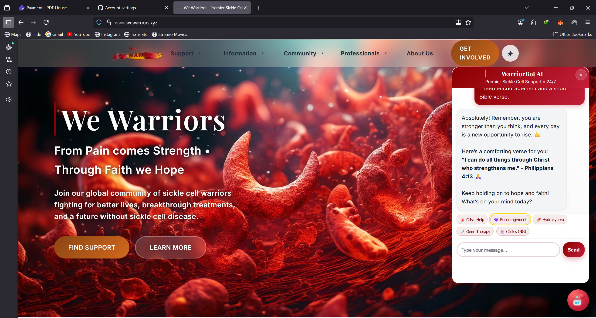
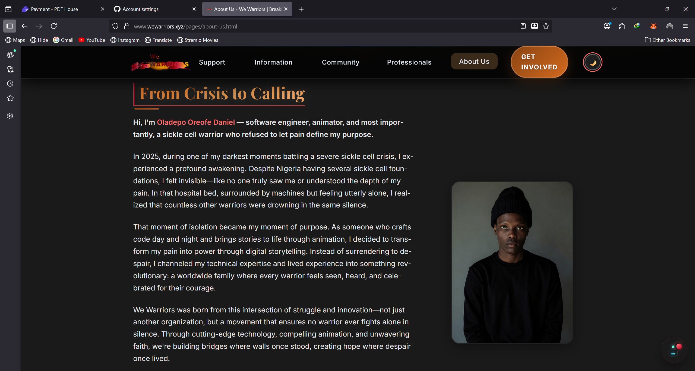
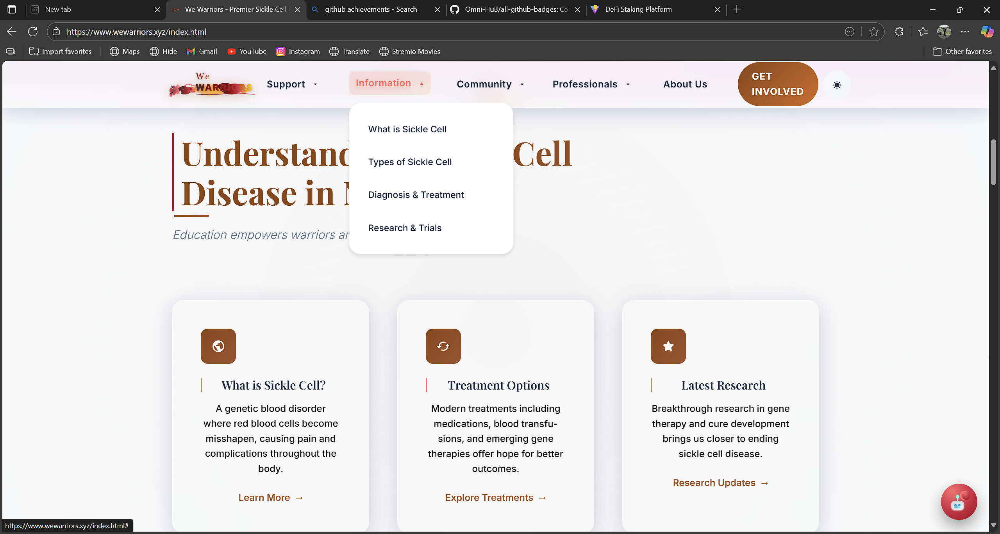

# 💉 We Warriors - Sickle Cell Support Website

**"From Pain comes Strength • Through Faith we Hope"**

A revolutionary, modern, and deeply inspiring website dedicated to empowering individuals and families affected by sickle cell disease. We Warriors serves as a comprehensive digital sanctuary connecting the global warrior community with essential resources, unwavering support, and transformative hope on their sacred journey from pain to strength.

## 🎯 Sacred Mission

**We Warriors** stands as a beacon of hope and strength for the global sickle cell community. Our sacred mission transcends traditional support - we are committed to transforming lives by:

✨ **Empowering Warriors**: Providing comprehensive resources, unwavering support, and life-changing connections
🌍 **Global Education**: Raising awareness and understanding to eliminate stigma and drive breakthrough research
🙏 **Faith-Centered Hope**: Anchoring our community in spiritual strength and divine purpose
💪 **Legacy Building**: Working toward the vision of the last generation affected by sickle cell disease

*Our platform embodies the sacred journey from pain to strength through unwavering faith and transformative hope.*

## ✨ Revolutionary Features

### 🎆 **Transformative User Experience**
- **🎨 Sacred Journey Theme**: Breathtaking maroon-to-gold gradient symbolizing the divine path from pain to strength
- **📱 Universal Access**: Flawlessly optimized for every device - from smartphones to desktops
- **♾️ Accessibility Champion**: WCAG 2.1 AA compliant with screen reader support, keyboard navigation, and inclusive design
- **🌌 Theme Harmony**: Beautiful dark/light mode toggle for personalized comfort
- **⚡ Lightning Performance**: Optimized for instant access during critical moments

### 🏥 **Comprehensive Support Ecosystem**
- **👩‍⚕️ Medical Excellence**: Curated specialist directories, world-class treatment centers, emergency protocols
- **💰 Financial Empowerment**: Insurance navigation, prescription assistance, travel grants, emergency relief funds
- **🎓 Educational Arsenal**: School advocacy toolkits, workplace rights guides, family education resources
- **🌟 Holistic Wellness**: Mental health support, nutritional guidance, pain management strategies

### 🌍 **Vibrant Warrior Community**
- **💫 Warrior Chronicles**: Inspiring testimonies of triumph, resilience, and divine strength
- **🤝 Sacred Circles**: Support groups fostering deep connections and mutual encouragement
- **🎆 Community Celebrations**: Awareness campaigns, victory gatherings, and milestone celebrations
- **🙏 Prayer Sanctuary**: 24/7 spiritual support network with faith-based resources and community prayers
- **🏆 Warrior Recognition**: Celebrating courage, achievements, and community contributions

### 📚 **Knowledge & Advocacy Hub**
- **🧬 Scientific Excellence**: Latest research, breakthrough treatments, and clinical trial opportunities
- **📢 Advocacy Arsenal**: Policy influence tools, awareness campaigns, and community mobilization resources
- **🌍 Global Awareness**: Educational content designed to eliminate stigma and drive understanding
- **📈 Progress Tracking**: Personal health journals, treatment tracking, and wellness monitoring

## 🎆 Revolutionary Website Showcase

Experience the transformative power of We Warriors - a digital sanctuary built with love, hope, and unwavering dedication to the sickle cell warrior community:

### 🌟 Inspiring Hero Experience

*The breathtaking "We Warriors" homepage featuring our sacred journey visualization from **Pain → Faith → Hope → Strength**. Witness the powerful branding with the inspiring tagline "From Pain comes Strength • Through Faith we Hope", beautiful floating journey elements, and stunning maroon-to-gold gradient theme that represents transformation and hope.*

### 🌍 Vibrant Community Features

*The heart of our warrior community showcasing:*
- **👥 Warrior Stories**: Powerful testimonials of triumph, faith, and resilience from our community
- **🤝 Support Network**: Connect with fellow warriors, share experiences, and find strength in unity
- **🎆 Community Events**: Awareness campaigns, support gatherings, and celebration of warrior victories
- **🙏 Prayer & Faith**: Spiritual support network with daily devotions and community prayer groups

### 📱 Perfect Mobile Experience

*Beautiful mobile-first design ensuring every warrior can access support anywhere, anytime:*
- **🚀 Lightning Fast**: Optimized performance for quick access during emergencies
- **🎨 Touch-Friendly**: Intuitive navigation designed for mobile warriors
- **♾️ Accessible**: WCAG compliant with screen reader support and high contrast
- **🌍 Global Reach**: Responsive design that works perfectly across all devices

### 🏥 Comprehensive Support Hub

*Your complete resource center organized into life-changing categories:*
- **🏥 Medical Support**: Specialist directories, treatment centers, emergency protocols, cutting-edge pain management
- **💰 Financial Relief**: Insurance navigation, prescription assistance, travel support, emergency funding
- **🎓 Educational Empowerment**: School advocacy tools, workplace rights, family education, caregiver resources
- **🌟 Holistic Care**: Mental health support, nutrition guidance, and lifestyle optimization for warriors

---

### Design Highlights

🎨 **Visual Excellence**: 
- Sophisticated maroon-to-gold gradient journey theme
- Clean, modern typography with Playfair Display and Inter fonts
- Beautiful floating animations and hover effects
- Consistent visual hierarchy throughout

♿ **Accessibility First**: 
- WCAG 2.1 AA compliant design
- High contrast ratios for readability
- Keyboard navigation support
- Screen reader compatible

📱 **Responsive Design**: 
- Mobile-first approach
- Beautiful layouts across all device sizes
- Touch-friendly interactions
- Progressive enhancement

## 🚀 Technical Stack

### Frontend
- **HTML5**: Semantic markup for accessibility and SEO
- **CSS3**: Modern styling with custom properties, flexbox, and grid
- **JavaScript**: Interactive features and modern ES6+ syntax
- **Typography**: Playfair Display (headings) and Inter (body text)

### Development Tools
- **Git**: Version control with comprehensive commit history
- **ESLint**: Code quality and consistency
- **Live Server**: Development server with hot reload
- **Responsive Design**: Mobile-first approach with progressive enhancement

## 🏗️ Architecture

### CSS Organization
```
css/
├── main.css           # Core styles and theme variables
├── responsive.css     # Mobile-first responsive design
├── accessibility.css  # WCAG compliance and a11y features
└── pages.css         # Modern page-specific styling
```

### JavaScript Modules
```
js/
├── main.js           # Core functionality and interactions
├── animations.js     # Smooth animations and transitions
└── modern.js        # Enhanced modern features
```

### Page Structure
```
├── index.html              # Homepage
├── support/               # Support resources
├── information/           # Educational content
├── community/             # Community features
├── pages/                 # Utility pages (contact, donate)
└── templates/             # Reusable components
```

## 🎨 Design System

### Color Palette (Journey Theme)
- **Pain**: `#2C0A1A` (Dark maroon)
- **Blood**: `#8B0000` to `#C41E3A` (Deep to bright red)
- **Hope**: `#FF6B6B` (Coral/salmon)
- **Faith**: `#FFD700` (Gold)
- **Strength**: `#FFA500` (Orange)

### Typography
- **Headings**: Playfair Display (elegant serif)
- **Body**: Inter (modern sans-serif)
- **Weights**: 300, 400, 500, 600, 700

## 🔧 Getting Started

### Prerequisites
- Git
- Node.js (for development tools)
- Modern web browser
- Code editor (VS Code recommended)

### Setup
```bash
# Clone the repository
git clone https://github.com/blaccdante/we-warriors-web.git
cd we-warriors-web

# Install development dependencies
npm install

# Start development server
npm start

# Or use Python's built-in server
python -m http.server 3000
```

### Development Commands
```bash
# Lint JavaScript files
npm run lint

# Format code with Prettier
npm run format

# Build for production
npm run build

# Run accessibility tests
npm run a11y
```

## ♿ Accessibility Features

- **WCAG 2.1 AA Compliance**: Meeting web accessibility standards
- **Keyboard Navigation**: Full site navigation without mouse
- **Screen Reader Support**: Semantic HTML and ARIA labels
- **Color Contrast**: Minimum 4.5:1 ratio for all text
- **Focus Indicators**: Clear visual focus states
- **Skip Links**: Jump to main content functionality

## 📱 Responsive Breakpoints

```css
/* Mobile First */
@media (min-width: 768px)  { /* Tablet */ }
@media (min-width: 1024px) { /* Desktop */ }
@media (min-width: 1200px) { /* Large Desktop */ }
@media (min-width: 1400px) { /* XL Desktop */ }
```

## 🤝 Contributing

We welcome contributions from the community! Whether you're a developer, designer, content creator, or warrior with a story to share, there are many ways to contribute:

### For Developers
1. Fork the repository
2. Create a feature branch (`git checkout -b feature/amazing-feature`)
3. Commit your changes (`git commit -m 'Add some amazing feature'`)
4. Push to the branch (`git push origin feature/amazing-feature`)
5. Open a Pull Request

### For Content Contributors
- Share warrior stories and testimonials
- Contribute educational content
- Help with translations
- Review content for accuracy

## 📄 License

This project is licensed under the MIT License - see the [LICENSE](LICENSE) file for details.

## 🙏 Acknowledgments

- **Sickle Cell Warriors**: For their strength, courage, and inspiration
- **Medical Community**: Healthcare providers fighting sickle cell disease
- **Families & Caregivers**: Supporting loved ones on their journey
- **Contributors**: Everyone who helps build and improve this platform
- **Community**: The broader sickle cell awareness movement

## 📞 Contact & Support

- **Website**: [We Warriors](https://blaccdante.github.io/we-warriors-web)
- **GitHub**: [@blaccdante](https://github.com/blaccdante)
- **Issues**: [Report bugs or request features](https://github.com/blaccdante/we-warriors-web/issues)

---

<div align="center">
  <strong>"From Pain comes Strength • Through Faith we Hope"</strong>
  <br><br>
  <sub>Built with ❤️ for the Warrior Community</sub>
</div>

## 🔄 Latest Revolutionary Updates

### Version 3.0.0 - Complete Platform Transformation 🎆
- ✨ **Breathtaking Visual Revolution**: Complete UI overhaul with sacred journey theme and inspiring aesthetics
- 📱 **Mobile-First Excellence**: Flawless responsive design optimized for warriors on-the-go
- ♾️ **Accessibility Champion**: WCAG 2.1 AA compliance ensuring every warrior can access support
- 🌍 **Community-Centered Design**: Enhanced warrior stories, support networks, and celebration features
- 🙏 **Spiritual Integration**: Deep faith-based resources and prayer sanctuary implementation
- ⚡ **Performance Optimization**: Lightning-fast loading for emergency access and critical support
- 🏥 **Comprehensive Resources**: Expanded medical, financial, and educational support systems
- 📊 **Analytics Integration**: User experience insights for continuous improvement
- 🎆 **Modern Architecture**: Scalable, maintainable codebase ready for global expansion

---

*This website serves as a beacon of hope and strength for all warriors fighting sickle cell disease. Together, we transform pain into power and struggle into strength.*
