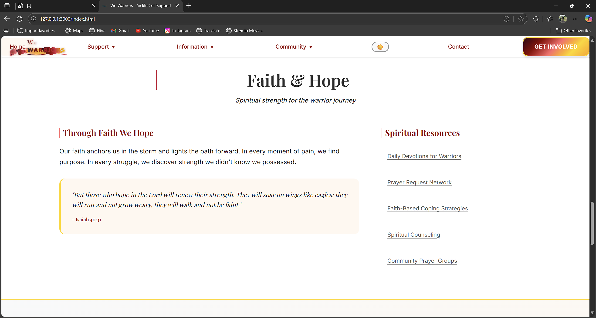
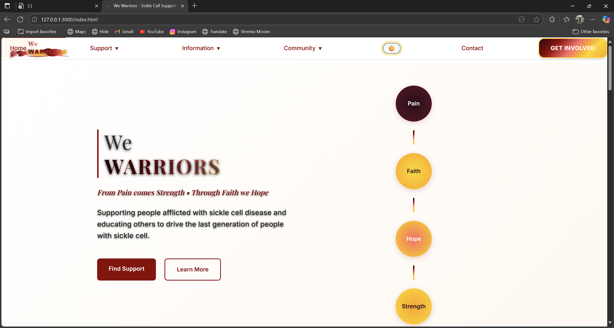
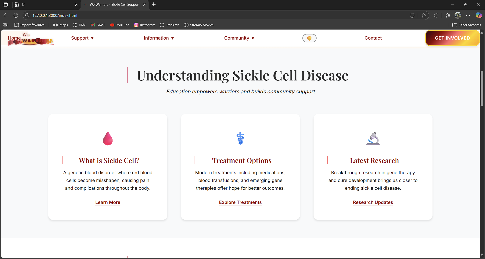
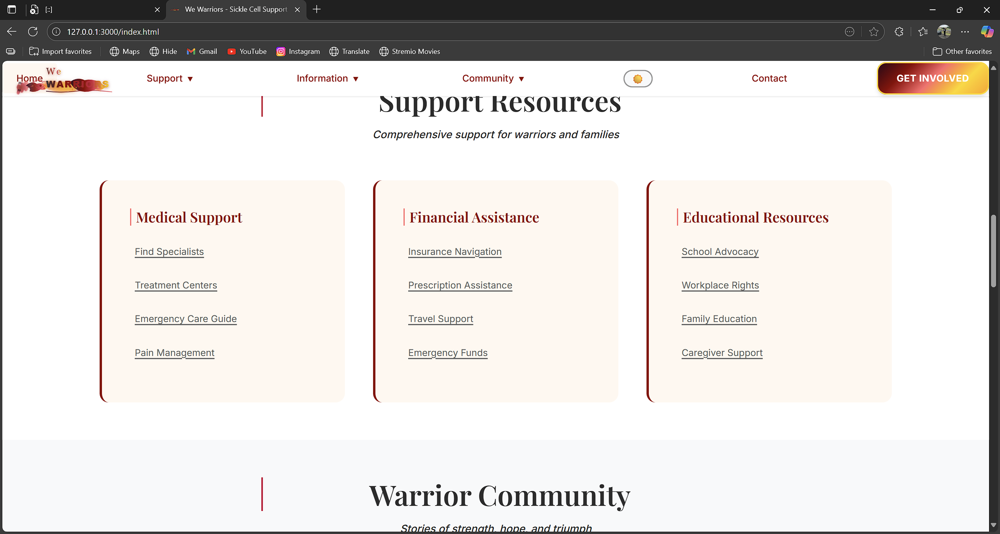
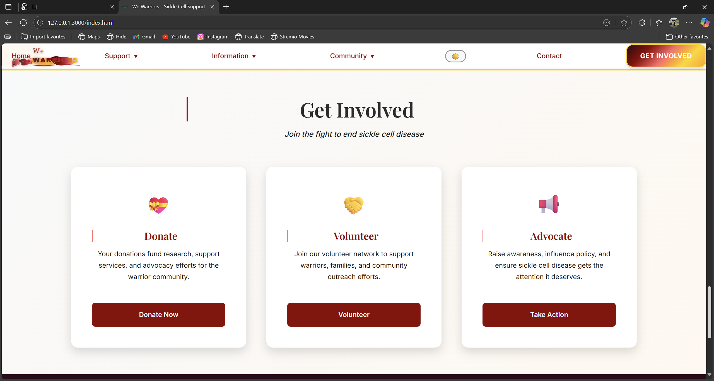
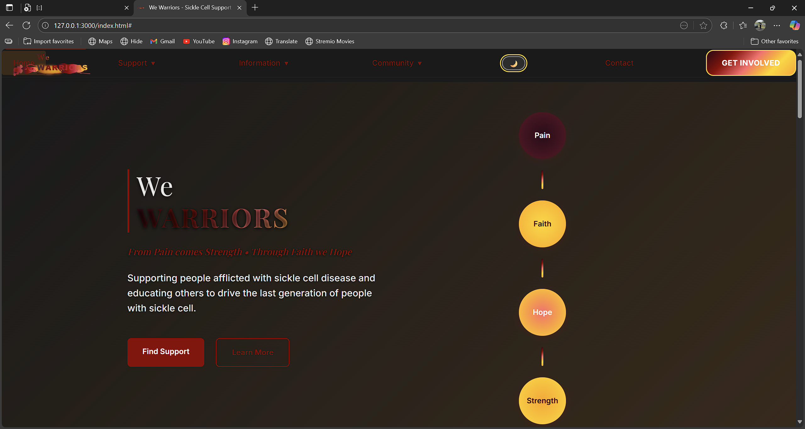

# We Warriors - Sickle Cell Support Website

**"From Pain comes Strength • Through Faith we Hope"**

A modern, accessible, and inspiring website dedicated to supporting individuals and families affected by sickle cell disease. We Warriors serves as a comprehensive platform connecting the community with resources, support, and hope on their journey from pain to strength.

## 🎯 Mission

We Warriors is committed to supporting people afflicted with sickle cell disease and educating others to drive the last generation of people with sickle cell. Our platform embodies the journey from pain to strength through faith and hope.

## ✨ Features

### 🎨 Modern Design & User Experience
- **Beautiful Journey Theme**: Sophisticated maroon-to-gold gradient representing the path from pain to strength
- **Responsive Design**: Optimized for all devices from mobile to desktop
- **Accessibility First**: WCAG compliant with skip links, ARIA labels, and keyboard navigation
- **Dark/Light Mode**: Toggle between themes for user preference

### 🏥 Support Resources
- **Medical Support**: Find specialists, treatment centers, emergency care guides
- **Financial Assistance**: Insurance navigation, prescription assistance, emergency funds
- **Educational Resources**: School advocacy, workplace rights, family education

### 🤝 Community Features
- **Warrior Stories**: Personal testimonies of strength, hope, and triumph
- **Support Groups**: Connect with others on similar journeys
- **Events**: Community gatherings, awareness campaigns, fundraising events
- **Prayer Network**: Spiritual support and faith-based resources

### 📚 Information Hub
- **Disease Education**: Comprehensive information about sickle cell disease
- **Treatment Options**: Latest treatments, research, and clinical trials
- **Advocacy Tools**: Resources for raising awareness and policy influence

## 🖼️ Website Showcase

Below are screenshots showcasing the beautiful, modern design and comprehensive features of the We Warriors platform:

### 1. Homepage - Hero Section

*The powerful "We Warriors" branding with the journey visualization showing the path from **Pain → Faith → Hope → Strength**. Features the clean logo design, inspiring tagline "From Pain comes Strength • Through Faith we Hope", and the floating journey elements with beautiful animations.*

### 2. Support Resources Page

*Comprehensive support sections organized into three main categories:*
- **Medical Support**: Find Specialists, Treatment Centers, Emergency Care Guide, Pain Management
- **Financial Assistance**: Insurance Navigation, Prescription Assistance, Travel Support, Emergency Funds  
- **Educational Resources**: School Advocacy, Workplace Rights, Family Education, Caregiver Support

### 3. Faith & Hope Section

*Spiritual strength resources featuring inspirational content with:*
- **Scripture**: "But those who hope in the Lord will renew their strength..." - Isaiah 40:31
- **Through Faith We Hope**: Message of faith anchoring warriors through the storm
- **Spiritual Resources**: Daily Devotions, Prayer Request Network, Faith-Based Coping Strategies, Community Prayer Groups

### 4. Get Involved Section  

*Multiple ways to contribute to the warrior community with beautifully designed call-to-action cards:*
- **💗 Donate**: Fund research, support services, and advocacy efforts for the warrior community
- **🤝 Volunteer**: Join the volunteer network to support warriors, families, and community outreach
- **📢 Advocate**: Raise awareness, influence policy, and ensure sickle cell disease gets the attention it deserves

### 5. Warrior Community Stories

*Community testimonials showcasing strength, hope, and triumph over adversity:*
- **Warrior Stories**: Personal testimonies like "Through faith, I found strength I never knew I had. Every crisis became a testimony of God's grace."
- **Connect & Support**: Join Support Groups, Share Your Story, Find Events
- **Community Strength**: Stories from warriors like **Rachel, 34, Sickle Cell Warrior** and others sharing their journeys

### 6. Dark Mode Hero Section

*The stunning dark mode view of the homepage showing:*
- **Elegant Dark Theme**: Beautiful contrast with the maroon-to-gold journey theme
- **Enhanced Readability**: Perfect visibility with the Journey visualization (Pain, Faith, Hope, Strength circles)
- **Modern Design**: Sophisticated dark background highlighting the "We Warriors" branding
- **Consistent Branding**: Clean navigation with theme toggle functionality

---

### Design Highlights

🎨 **Visual Excellence**: 
- Sophisticated maroon-to-gold gradient journey theme
- Clean, modern typography with Playfair Display and Inter fonts
- Beautiful floating animations and hover effects
- Consistent visual hierarchy throughout

♿ **Accessibility First**: 
- WCAG 2.1 AA compliant design
- High contrast ratios for readability
- Keyboard navigation support
- Screen reader compatible

📱 **Responsive Design**: 
- Mobile-first approach
- Beautiful layouts across all device sizes
- Touch-friendly interactions
- Progressive enhancement

## 🚀 Technical Stack

### Frontend
- **HTML5**: Semantic markup for accessibility and SEO
- **CSS3**: Modern styling with custom properties, flexbox, and grid
- **JavaScript**: Interactive features and modern ES6+ syntax
- **Typography**: Playfair Display (headings) and Inter (body text)

### Development Tools
- **Git**: Version control with comprehensive commit history
- **ESLint**: Code quality and consistency
- **Live Server**: Development server with hot reload
- **Responsive Design**: Mobile-first approach with progressive enhancement

## 🏗️ Architecture

### CSS Organization
```
css/
├── main.css           # Core styles and theme variables
├── responsive.css     # Mobile-first responsive design
├── accessibility.css  # WCAG compliance and a11y features
└── pages.css         # Modern page-specific styling
```

### JavaScript Modules
```
js/
├── main.js           # Core functionality and interactions
├── animations.js     # Smooth animations and transitions
└── modern.js        # Enhanced modern features
```

### Page Structure
```
├── index.html              # Homepage
├── support/               # Support resources
├── information/           # Educational content
├── community/             # Community features
├── pages/                 # Utility pages (contact, donate)
└── templates/             # Reusable components
```

## 🎨 Design System

### Color Palette (Journey Theme)
- **Pain**: `#2C0A1A` (Dark maroon)
- **Blood**: `#8B0000` to `#C41E3A` (Deep to bright red)
- **Hope**: `#FF6B6B` (Coral/salmon)
- **Faith**: `#FFD700` (Gold)
- **Strength**: `#FFA500` (Orange)

### Typography
- **Headings**: Playfair Display (elegant serif)
- **Body**: Inter (modern sans-serif)
- **Weights**: 300, 400, 500, 600, 700

## 🔧 Getting Started

### Prerequisites
- Git
- Node.js (for development tools)
- Modern web browser
- Code editor (VS Code recommended)

### Setup
```bash
# Clone the repository
git clone https://github.com/blaccdante/we-warriors-web.git
cd we-warriors-web

# Install development dependencies
npm install

# Start development server
npm start

# Or use Python's built-in server
python -m http.server 3000
```

### Development Commands
```bash
# Lint JavaScript files
npm run lint

# Format code with Prettier
npm run format

# Build for production
npm run build

# Run accessibility tests
npm run a11y
```

## ♿ Accessibility Features

- **WCAG 2.1 AA Compliance**: Meeting web accessibility standards
- **Keyboard Navigation**: Full site navigation without mouse
- **Screen Reader Support**: Semantic HTML and ARIA labels
- **Color Contrast**: Minimum 4.5:1 ratio for all text
- **Focus Indicators**: Clear visual focus states
- **Skip Links**: Jump to main content functionality

## 📱 Responsive Breakpoints

```css
/* Mobile First */
@media (min-width: 768px)  { /* Tablet */ }
@media (min-width: 1024px) { /* Desktop */ }
@media (min-width: 1200px) { /* Large Desktop */ }
@media (min-width: 1400px) { /* XL Desktop */ }
```

## 🤝 Contributing

We welcome contributions from the community! Whether you're a developer, designer, content creator, or warrior with a story to share, there are many ways to contribute:

### For Developers
1. Fork the repository
2. Create a feature branch (`git checkout -b feature/amazing-feature`)
3. Commit your changes (`git commit -m 'Add some amazing feature'`)
4. Push to the branch (`git push origin feature/amazing-feature`)
5. Open a Pull Request

### For Content Contributors
- Share warrior stories and testimonials
- Contribute educational content
- Help with translations
- Review content for accuracy

## 📄 License

This project is licensed under the MIT License - see the [LICENSE](LICENSE) file for details.

## 🙏 Acknowledgments

- **Sickle Cell Warriors**: For their strength, courage, and inspiration
- **Medical Community**: Healthcare providers fighting sickle cell disease
- **Families & Caregivers**: Supporting loved ones on their journey
- **Contributors**: Everyone who helps build and improve this platform
- **Community**: The broader sickle cell awareness movement

## 📞 Contact & Support

- **Website**: [We Warriors](https://blaccdante.github.io/we-warriors-web)
- **GitHub**: [@blaccdante](https://github.com/blaccdante)
- **Issues**: [Report bugs or request features](https://github.com/blaccdante/we-warriors-web/issues)

---

<div align="center">
  <strong>"From Pain comes Strength • Through Faith we Hope"</strong>
  <br><br>
  <sub>Built with ❤️ for the Warrior Community</sub>
</div>

## 🔄 Recent Updates

### Version 2.0.0 - Major UI/UX Overhaul
- ✨ Complete redesign with modern journey theme
- 🎨 Enhanced accessibility and responsive design
- 🏗️ Modular CSS architecture implementation
- 📱 Mobile-first responsive approach
- ⚡ Improved performance and animations
- 🎯 Comprehensive content structure
- 🔧 Development tooling improvements

---

*This website serves as a beacon of hope and strength for all warriors fighting sickle cell disease. Together, we transform pain into power and struggle into strength.*
